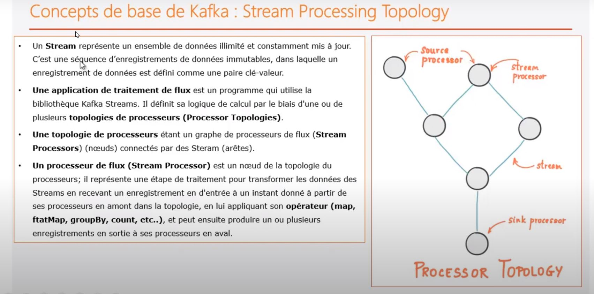

# stream kakfka

Application consiste à spliter une chaine de caractere, puis à ne sonserver que les lettres a et b et ensuite faire un groupby toutes les 5 sesondes.


Kafka stream s'utilise directement sur l'appliacation ou un microservice dédié. Toutes les opérations de streaming sont faite coté applicatoin et non coté server kafka. 

## KStreams et KTables
Deux types de streams existent dans l’API : les KStreams et les KTables. Les **KTables** sont des Streams « **finis** », ou encore selon la nomenclature de Kafka : « **compactés** ». Alors qu’un **KStream** représente un topic Kafka « **infini** », une **KTable** est un topic pour lequel chaque nouveau message **clé/valeur écrase l’ancien message avec la même clé**, ou insère le message si la clé est nouvelle. Ce n’est finalement qu’une simple Map <clé,valeur>.


## introduction





````shell script
λ   .\bin\windows\kafka-console-consumer.bat --bootstrap-server localhost:9092 --topic resultTopic  --property print.key=true --property print.value=true  --property key.deserializer=org.apache.kafka.common.serialization.StringDeserializer --property value.deserializer=org.apache.kafka.common.serialization.StringDeserializer
[2020-05-13 18:26:07,717] WARN [Consumer clientId=consumer-console-consumer-66466-1, groupId=console-consumer-66466] Error while fetching metadata with correlation id 2 : {resultTopic=LEADER_NOT_AVAILABLE} (org.apache.kafka.clients.NetworkClient)
null    b
null    b
null    b
null    a
null    a
````


````shell script
λ .\bin\windows\kafka-console-consumer.bat --bootstrap-server localhost:9092 --topic resultTopic  --property print.key=true --property print.value=true  --property key.deserializer=org.apache.kafka.common.serialization.StringDeserializer --property value.deserializer=org.apache.kafka.common.serialization.LongDeserializer
2020-05-13T16:54:45Z-2020-05-13T16:54:50Z--a    1
2020-05-13T16:54:45Z-2020-05-13T16:54:50Z--b    5
2020-05-13T16:54:50Z-2020-05-13T16:54:55Z--a    1
2020-05-13T16:54:50Z-2020-05-13T16:54:55Z--a    2
````

